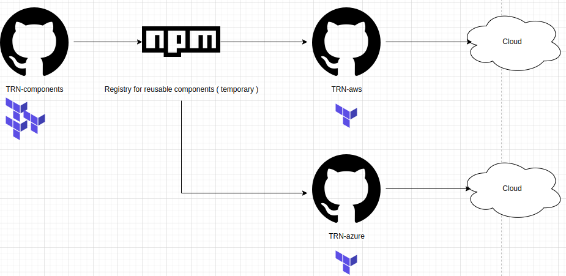

# CDKTF Infrastructure Components and Constructs

This repository hosts a comprehensive collection of CDKTF (Cloud Development Kit for Terraform) components and constructs for AWS and Azure cloud platforms. It serves as a practical toolkit for individuals keen on mastering infrastructure automation, CI/CD processes, and multi-cloud strategies.

## Overview

Our components and constructs are designed to be modular and reusable, enabling efficient setup of complex cloud infrastructure elements across AWS and Azure. They embody infrastructure-as-code (IaC) best practices and are perfect for learning and applying CI/CD and automation techniques in real-world scenarios.


### Flow after deploying component to library some registry



### Contents

- **VPC & Network Constructs (AWS):** Set up AWS Virtual Private Clouds, subnets, internet gateways, and NAT gateways.
- **Azure Network Constructs:** Tools for creating Azure Virtual Networks, subnets, and network security groups.
- **EKS & AKS Cluster Constructs:** Manage Kubernetes clusters using AWS EKS and Azure AKS, facilitating container orchestration.
- **CI/CD Components:** Scripts and configurations for CI/CD pipelines, compatible with both AWS and Azure environments.
- **Repository Automation:** Automate the setup of GitHub repositories for managing infrastructure projects.

### Skills Covered

- **Multi-Cloud Infrastructure Automation:** Utilize CDKTF for IaC across AWS and Azure.
- **CI/CD Mastery:** Implement automated pipelines for consistent and efficient deployment.
- **Networking Expertise:** Configure and manage cloud networking on AWS and Azure.
- **Container Orchestration:** Handle Kubernetes clusters using AWS EKS and Azure AKS.

## Getting Started

To use these components, you should have a foundational knowledge of Terraform, AWS, Azure services, and containerization concepts.

### Prerequisites

- AWS and Azure accounts.
- Terraform and CDKTF installations.
- Basic understanding of AWS (VPC, EC2, EKS) and Azure services.
- Familiarity with Kubernetes for orchestrating containers.

### Installation

1. **Clone the Repository:**
   ```bash
   git clone https://github.com/<your-github-username>/cdktf-components.git
   cd cdktf-components
